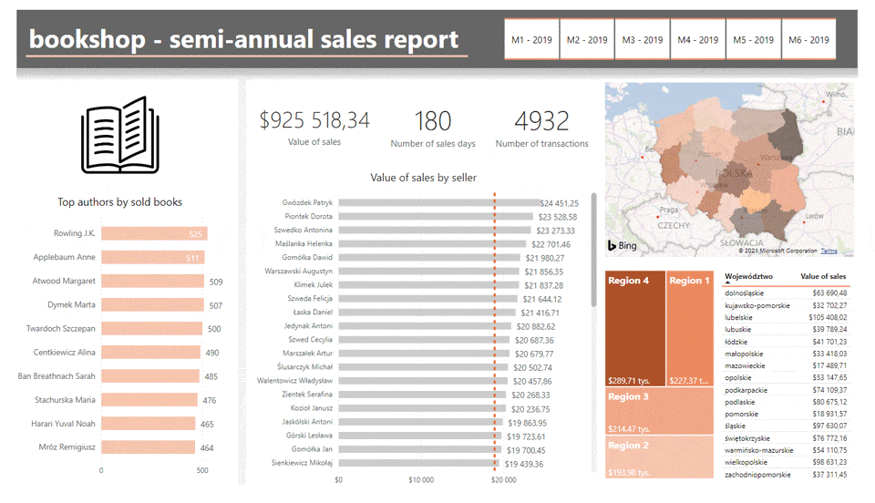
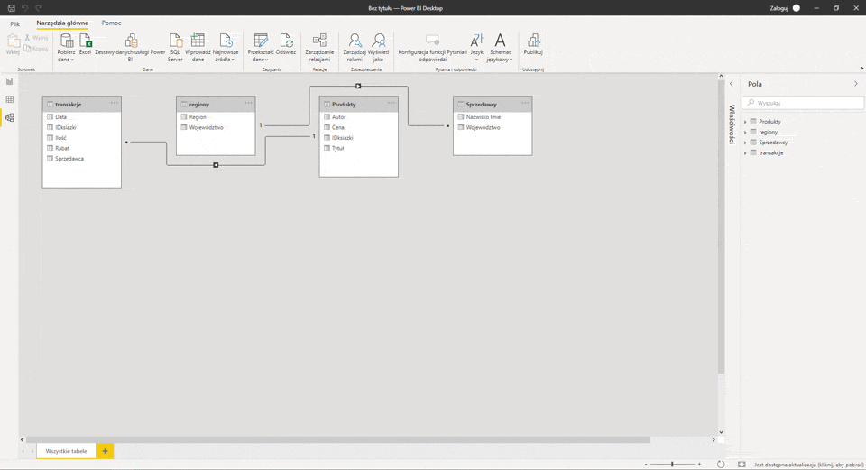

# About project
This is an example of an analytical report for a six-month bookstore sale. It was made using Microsoft PowerBI Desktop (visualization), PowerQuery (getting, transforming), PowerPivot (relations, connecting, model), DAX language and Excel. The data was randomly generated by the author. </br></br>

## Final file </br>


# Workflow </br>

## 1. Import and merge data </br>

Import Transactions in Excel format (6 files with data from 6 months of 2019). Link, Clean, and Transform with PowerQuery. Filtering duplicates. Import to PowerBI.


## 2. Join data </br>

Regions excel file added. Data transformation - change of headers. An additional 3 data tables have been added.


## 3. Add relations

Create relationships between tables. The data model has been created.



## 4. Add measures

Writing a measure Values of sales using the DAX language using function SUMX.
```
Value of sales =
SUMX(
   	 transakcje,
  	  transakcje[Ilość]*RELATED(Produkty[Cena])*(1-transakcje[Rabat])
)
```
Change the display of the format of a measure. Visualization of the measure with a card.
</br>
Calculation of the number of all transactions in the first half of 2019 - creating a new measure.
```
Number of transactions =
COUNTROWS(transakcje)

```
Visualization of the measure with a card.
</br>
Calculation of the number of sales days (counting unique results in the Date column).
```
Number of sales days = 
DISTINCTCOUNT(transakcje[Data])
```
Visualization of the measure with a card.
</br>
