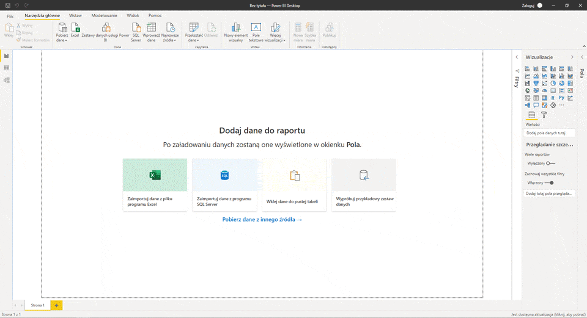
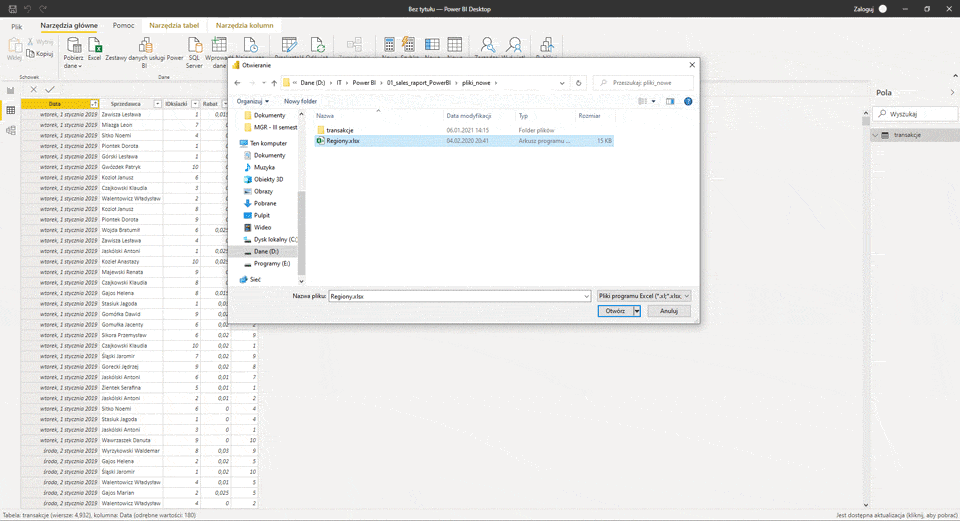

# About project
This is an example of an analytical report for a six-month bookstore sale. It was made using Microsoft PowerBI Desktop (visualization), PowerQuery (getting, transforming), PowerPivot (relations, connecting, model), DAX language and Excel. The data was randomly generated by the author.   

## Final file  

# Workflow  

## 1. Import and merge data  

Import Transactions in Excel format (6 files with data from 6 months of 2019). Link, Clean, and Transform with PowerQuery. Filtering duplicates. Import to PowerBI.

 

 

## 2. Join data  

Regions excel file added. Data transformation - change of headers. An additional 3 data tables have been added.

 

 

