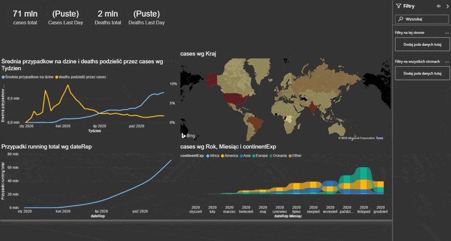

# About project
Hi, this project was making in Microsoft Power BI. On my desktop. It's my work. 

## what questions does it answer?
  // what is total cos  
  // what are  
  // itp  

# Work flow
1. prepare data - source
(photo?)
2. clean data
3. DAX
4.

# Final effect

